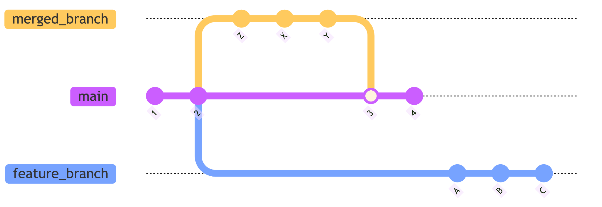
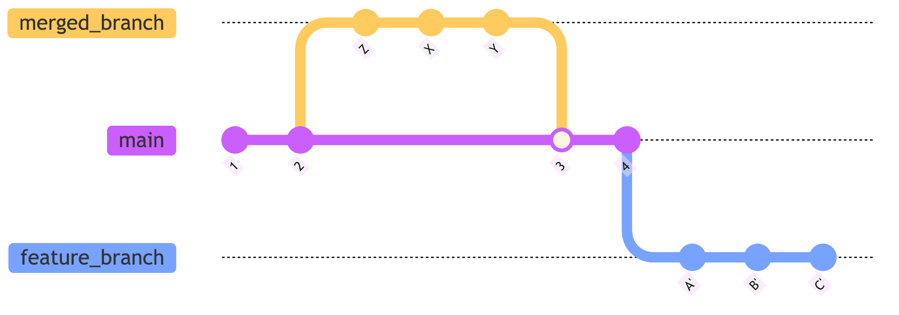

+++
title = "Git - (Re)Travailler l'historique"
date = '2025-02-27'
draft = false
tags = ["Git", "Rebase"]
showTableOfContents = true
+++

Lors de ma [conférence à Mixit](),
j'évoque la ré-écriture de l'historique git.
Cet article a pour objectif de donner des billes pour
une réécriture d'historique sans peur.

--- 

# Pré-requis

Avant de s'amuser à réécrire l'historique, assurez-vous de deux choses :
 - Vous êtes sur votre branche de développement. (Je vous déconseille vivement de faire ça sur la branche principale)
 - Vous êtes à jours sur votre branche. Et vous n'avez pas de collégue avec un travail en cours sur celle-ci.

---

# Git rebase

## Explication

``git rebase`` est un procédé qui permet de déplacer un ensemble de commits 
sur un nouveau commit de base.

Dans notre exemple, nous avons travaillé sur la branche `feature_branch` 
et entre temps la branche principale `main` a évolué avec le contenu de la branche `merged_branch`.

On peut ainsi se rebaser sur le dernier commit de  ``main`` (le `4`).

Le rebase simple apporte déjà de la valeur en permettant un flux git plus
linéaire. La relecture se fait donc plus facilement. Le relecteur n'aura pas à prendre
en compte le(s) potentiels commits de merge.

Pour le développeur de la branche, cela implique donc de gérer les conflits directement au moment du rebase.

## Rebase interactif

C'est avec ``rebase -i`` le rebase interactif que tout l'intérêt du rebase se révèle.

Le rebase interactif nous permet d'appliquer un ensemble de modification à l'application 
des commits sur leurs nouvelles bases. 
Voici une liste non exhaustive des actions :
- `pick`: Garder le commit tel quel
- `reword`: Changer le message de commit
- `edit`: S'arrêter au moment de l'application du commit pour pouvoir le modifier
- `squash`: Fusionner le commit avec le précédent
- `fixup`: Fusionner le commit avec le précédent en gardant le message du commit précédent
- `drop`: Supprimer le commit

Lors d'un rebase interactif, il est possible d'inverser l'ordre des commits qui sont en train d'être déplacés.

En combinant déplacement, et des commandes comme `squash` et `edit` il devient donc possible de réécrire facilement
l'historique.

## Intention
La réécriture de l'historique doit être faite dans l'objectif de montrer l'intention
de chacun d'eux.
Par exemple, on peut avoir des commits mettant en place des classes et d'autres les utilisant.

---

# Gestion des conflits
Lors d'un ``rebase``, il est possible que certains conflits apparaissent. 

Ils sont le plus souvent de deux sortes : 

## Conflit avec la nouvelle base
Lors que la base (le plus souvent la branche principale) a évolué, il est
possible qu'un `rebase` voit certains de ses commits rentrer en conflit.

La plupart du temps ces conflits se règlent comme on règle un conflit lors d'un merge :
Il faut comprendre ce qui a été modifié dans la branche principale et changer son commit en fonction.

## Conflit lors d'un déplacement
Changer l'ordre de deux commits sur sa branche peut être intéressant afin de mieux
montrer ses intentions.

Dans ce cas, si le commit B est déplacé avant le A et que les deux contiennent
des modifications sur les mêmes fichiers, il est important de garder en tête 
l'objectif de chacun des commits pour savoir quelle modification va dans quel commit.

## Conseil
Avant de faire un rebase interactif pour déplacer des commits je 
réalise un `rebase` classique sur la même base afin de gérer ces deux types de conflits
séparément.

---

# Autosquash

Lors d'un développement, il arrive souvent de faire une modification qui aurait 
dû se trouver dans un des commits précédent.

- Si le commit cible est le dernier, un simple ``commit --amend`` suffit.

- Si le commit cible est plus loin dans l'historique, il faut : 
  - Créer un commit.
  - Faire un `rebase -i`.
  - Déplacer le commit au bon endroit.
  - `fixup` ou `squash` le commit dans sa cible.

Ces quatre étapes peuvent être faites beaucoup plus facilement grace au flag `--autosquash`.

Ce flag trouve les commits dont le message commence par ``fixup!`` et les squash automatiquement
dans le commit référencé dans la suite du message. 

Cette référence peut se faire soit via le SHA ``fixup! 123abc`` 
soit par le message du commit ``fixup! Add the ABC feature``.

Si vous suivez le [conseil](#conseil) sur la gestion des conflits, je vous 
recommande d'utiliser le message du commit cible, car le SHA sera modifié
lors du premier rebase.

---

# Reflog
Si à un moment, vous n'êtes plus sûr de ce que vous avez fait, la commande 
``git reflog`` permet de voir la trace de toutes les actions git, faites et ainsi 
de revenir là où vous le souhaitez (avant d'avoir mélangé tous ces commits que vous 
vouliez garder par exemple).

